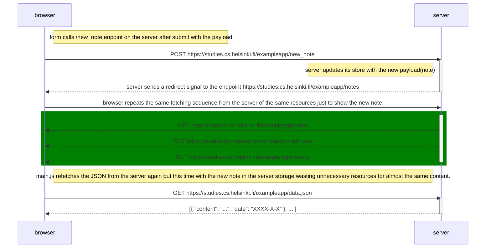

```mermaid
sequenceDiagram
    participant browser
    participant server

    Note right of browser: form calls /new_note enpoint on the server after submit with the payload
    browser->>server: POST https://studies.cs.helsinki.fi/exampleapp/new_note
    activate server
    Note left of server: server updates its store with the new payload(note)
    server-->>browser: server sends a redirect signal to the endpoint https://studies.cs.helsinki.fi/exampleapp/notes
    deactivate server

    %%browser->>browser: main.js event handler triggers on readyState 4 and status code 200

    browser->>server: browser repeats the same fetching sequence from the server of the same resources just to show the new note
    rect green
        activate server
        server-->>browser: GET https://studies.cs.helsinki.fi/exampleapp/notes
        server-->>browser: GET https://studies.cs.helsinki.fi/exampleapp/main.css
        server-->>browser: GET https://studies.cs.helsinki.fi/exampleapp/main.js
        deactivate server
    end

    Note right of browser: main.js refetches the JSON from the server again but this time with the new note in the server storage wasting unnecessary resources for almost the same content.

    browser->>server: GET https://studies.cs.helsinki.fi/exampleapp/data.json
    activate server
    server-->>browser: [{ "content": "...", "date": "XXXX-X-X" }, ... ]
    deactivate server
```
