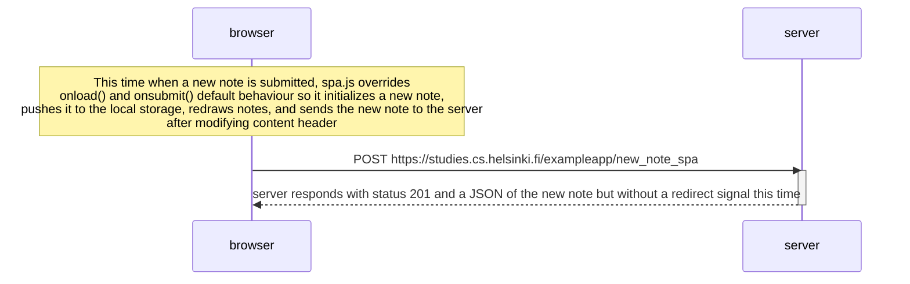

```mermaid
sequenceDiagram
    participant browser
    participant server
    
    Note over browser: This time when a new note is submitted, spa.js overrides<br>onload() and onsubmit() default behaviour so it initializes a new note, <br>pushes it to the local storage, redraws notes, and sends the new note to the server <br>after modifying content header
    browser->>server: POST https://studies.cs.helsinki.fi/exampleapp/new_note_spa
    activate server
    server-->>browser: server responds with status 201 and a JSON of the new note but without a redirect signal this time
    deactivate server
```
