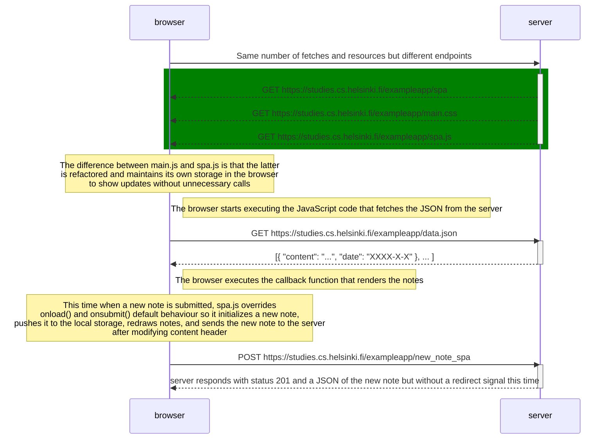

```mermaid
sequenceDiagram
    participant browser
    participant server

    browser->>server: Same number of fetches and resources but different endpoints
    rect green
        activate server
        server-->>browser: GET https://studies.cs.helsinki.fi/exampleapp/spa
        server-->>browser: GET https://studies.cs.helsinki.fi/exampleapp/main.css
        server-->>browser: GET https://studies.cs.helsinki.fi/exampleapp/spa.js
        deactivate server
    end
    Note over browser: The difference between main.js and spa.js is that the latter<br>is refactored and maintains its own storage in the browser<br>to show updates without unnecessary calls

    Note right of browser: The browser starts executing the JavaScript code that fetches the JSON from the server

    browser->>server: GET https://studies.cs.helsinki.fi/exampleapp/data.json
    activate server
    server-->>browser: [{ "content": "...", "date": "XXXX-X-X" }, ... ]
    deactivate server

    Note right of browser: The browser executes the callback function that renders the notes

    Note over browser: This time when a new note is submitted, spa.js overrides<br>onload() and onsubmit() default behaviour so it initializes a new note, <br>pushes it to the local storage, redraws notes, and sends the new note to the server <br>after modifying content header
    browser->>server: POST https://studies.cs.helsinki.fi/exampleapp/new_note_spa
    activate server
    server-->>browser: server responds with status 201 and a JSON of the new note but without a redirect signal this time
    deactivate server
```
